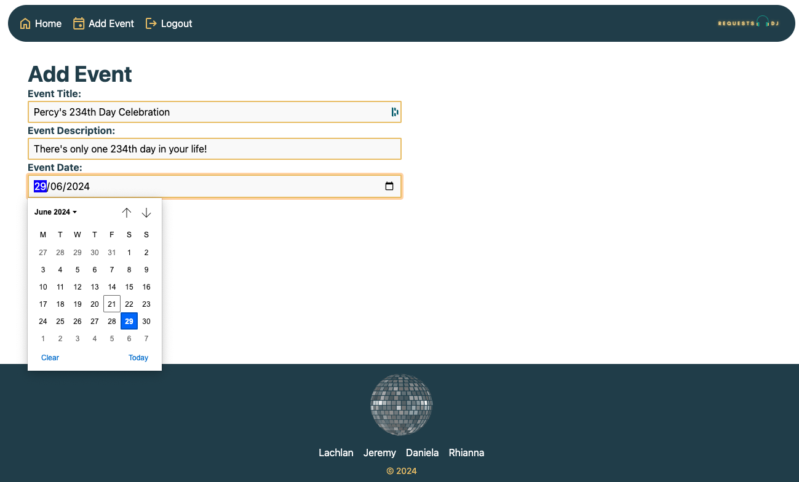

# Requests-DJ

## Description

The ultimate song request management app for DJs and party guests! DJs can create events that guests can use to make song requests, both in the days leading up to and event and during the event itself. It's a great tool for a DJ to play the songs that the guests want to hear!

## Table of Contents

- [Directory Structure](#directory_structure)
- [Usage](#usage)
- [Technology](#technology)
- [Screenshots](#screenshots)
- [Credits](#credits)

## Directory_Structure

```md
├── requests-dj/
  ├── assets/
    ├── screenshots/
  ├── config/ 
  ├── controllers/  
    ├── api/
  ├── db/   
  ├── models/                   
  ├── public
    ├── css/ 
    ├── images/
    ├── js/
  ├── seeds/
  ├── utils/
    ├── helpers/     
  ├── views/
    ├── layouts/
    ├── partials/                     
```

## Usage

Deployed link on Render.com: [Requests DJ](https://requests-dj.onrender.com/ "link to deployed app")

Note given free-tier, the database can take a few minutes to spin up.

## Technology

- Node
- Date-fns Module
- Handlebars
- JavaScript
- Postgres
- Sequelize
- Render
- Tailwind

### Screenshots





## Credits

[Jeremy White](https://github.com/roughnut "Jeremy's Github profile") | [Rhianna Wilson](https://github.com/rhiannawilson "Rhianna's Github profile") | [Lachlan Hughes](https://github.com/CinosMagician "Lachlan's Github profile") | [Daniela Leal](https://github.com/falfada "Daniela's Github profile")
